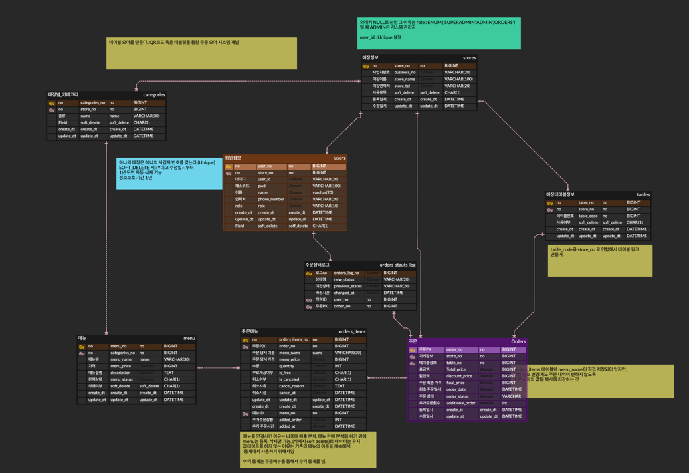

### ✅QR기반 테이블 주문 서비스 시스템(2025.05.21 기준)  
```markdown
# 🧾 Gaeng'sOrder

> 🚧 **진행 중인 백엔드 프로젝트** | 설계 시작: 2025.05  
> 핵심 기능 대부분 완료, 주문 기능 개발 중  
> 5월 말~6월 초까지 관리자 분석 기능 포함한 백엔드 개발 완료 예정

QR 기반 테이블 오더 시스템 백엔드 API 프로젝트입니다.  
실제 매장에서 사용 가능한 구조를 목표로, 도메인 주도 설계(DDD) 기반으로 구현하고 있습니다.  
인증, 메뉴/주문 관리, 매출 분석까지 모두 백엔드 중심으로 설계되었으며,  
향후 CI/CD 및 성능 최적화 실험까지 고려한 구조로 개발 중입니다.

---

## 📌 프로젝트 개요

| 항목         | 내용 |
|--------------|------|
| 프로젝트명   | GaengOrder |
| 개발 기간     | 2025.05 ~ 진행 중 |
| 주요 기능     | QR 테이블 오더, 주문 관리, 관리자 매출 분석 |
| 기술 스택     | Spring Boot, MyBatis, JPA, MySQL, JWT, Swagger |
| 문서화        | Swagger 3, Velog |
| 배포 예정     | GitHub Actions + Docker + EC2 |
| 저장소        | [GitHub 바로가기](https://github.com/gaengmin/GaengOrder_BackEnd) |
| 블로그        | [Velog - 개발 블로그](https://velog.io/@gaengmin/posts?tag=%EB%82%98%ED%98%BC%ED%94%84) |

---

## 🎯 핵심 기능

### ✅ 고객 기능
- QR 코드 기반 비로그인 테이블 주문 
- 장바구니 기반 주문 요청 (Frontend)
- 추가 주문 기능 
- 주문 상태 확인 및 변경
- JWT 기반 로그인/회원가입

### ✅ 관리자/직원 기능
- 매장 정보/테이블/메뉴 관리
- 주문 상태 변경 처리 (5월 25일 까지)
- 매출/판매 분석 API (5월 말이나 6월초까지)
  - 메뉴별 매출 총액, 판매 수량, 인기 메뉴 TOP-N
  - 일별/시간대별 매출 통계

### 🚧 개발 중 기능 (예정)
- CI/CD 자동 배포 (GitHub Actions → EC2)
- 관리자 대시보드 프론트 (추후 Vue 또는 React)
- 알림 기능 (WebSocket or SSE)
- 쿼리 인덱싱 실험 및 성능 비교 분석

---

## 📐 ERD 설계

> 실시간 주문/추가 주문/상태 이력/가격 이력까지 반영된 실무형 ERD

![ERD]

- `orders` + `orders_items`: 기본 주문 구조
- `orders_status_log`: 주문 상태 변경 이력
- `is_added`, `cancel_reason`, `is_free` 등 주문 세부 구분 컬럼
- 가격/이름 이력은 주문 시점 `orders_items`에 복사 저장
- Soft Delete는 메뉴, 유저, 테이블 등에만 적용

---

## 🔒 인증 처리

- JWT 기반 Access/Refresh 토큰 발급
- Spring Security + Filter 기반 인증 흐름
- `auth/filter` 내부: `LoginFilter`, `JWTFilter`, `LogoutFilter`
- 쿠키를 통한 Refresh Token 관리
- 사용자 권한(Role)에 따른 분기 처리

---

## 📦 패키지 구조

DDD 설계 기반으로 각 도메인을 중심으로 분리 구성

```
tableOrder
├── auth        # 인증/인가(JWT) 처리
├── category    # 카테고리 관리
├── common      # 공통 응답, 예외, Enum, 유틸
├── config      # Swagger, Security 설정
├── menu        # 메뉴 CRUD 및 가격/이름 이력 저장
├── refresh     # Refresh Token 엔티티 및 Repository
├── stores      # 매장 관리
├── tables      # 테이블 관리
├── users       # 유저 관리 및 권한 처리
├── resources
│   ├── mapper          # MyBatis XML 매퍼
│   └── db              # DB 초기화 SQL
└── TableOrderApplication.java
````

- DTO는 `request`, `response`로 명확히 분리
- Mapper + JPA 병행 적용 (유연한 DAO 계층 구성)
- Exception은 `GlobalExceptionHandler`를 통해 통합 처리

---

## 🛠 사용 기술 상세

| 항목 | 내용 |
|------|------|
| 프레임워크 | Spring Boot 3 |
| ORM | JPA (일부 MyBatis 병행) |
| DB | MySQL 8 |
| 보안 | JWT (Access/Refresh), Security FilterChain |
| 문서화 | Swagger (springdoc-openapi) |
| 배포 | (예정) Docker + GitHub Actions + EC2 |
| 형상 관리 | Git, GitHub |

---

## 🧪 API 문서

Swagger 기반 API 문서 자동화 구축 완료  
(배포 후 아래 주소로 접근 가능)

현재는 local에서 추가로 등록
링크 추가 예정
````

## ✍️ 개발 블로그 (Velog)

설계 과정, 인증 처리 흐름, 주문 로직, 데이터 흐름 등 상세히 기록
Velog 시리즈 👉 [나혼프 - 개발 블로그 전체 보기](https://velog.io/@gaengmin/posts?tag=%EB%82%98%ED%98%BC%ED%94%84)

---

## 🗓️ 개발 일정

| 기간                  | 내용                               |
|---------------------|----------------------------------|
| 2025.05.03 \~ 05.06 | 도메인 설계, ERD, 테이블 구조 설계           |
| 2025.05.06 \~ 05.20 | 회원가입, 메뉴/테이블/매장 관리 API 개발        |
| 2025.05.21 \~ 05.25 | 주문 기능 구현 중 (주문 처리)               |
| 2025.05.26 \~ 05.31 | 관리자 매출 분석, 인기메뉴 조회 API 완성 예정     |
| 2025.06 이후          | CI/CD, 인덱싱 실험, 성능 최적화, 관리자 프론트 연동 |

---

## 📈 향후 계획 (To-Do)

* [ ] 주문 API 완료 및 Swagger 시연 가능 상태 만들기
* [ ] 관리자 매출/판매 분석 API 고도화
* [ ] GitHub Actions + Docker + EC2 기반 CI/CD 자동화
* [ ] 인덱싱 성능 비교 실험 및 블로그 정리
* [ ] 알림 기능 (WebSocket) 및 관리자용 프론트 분리
